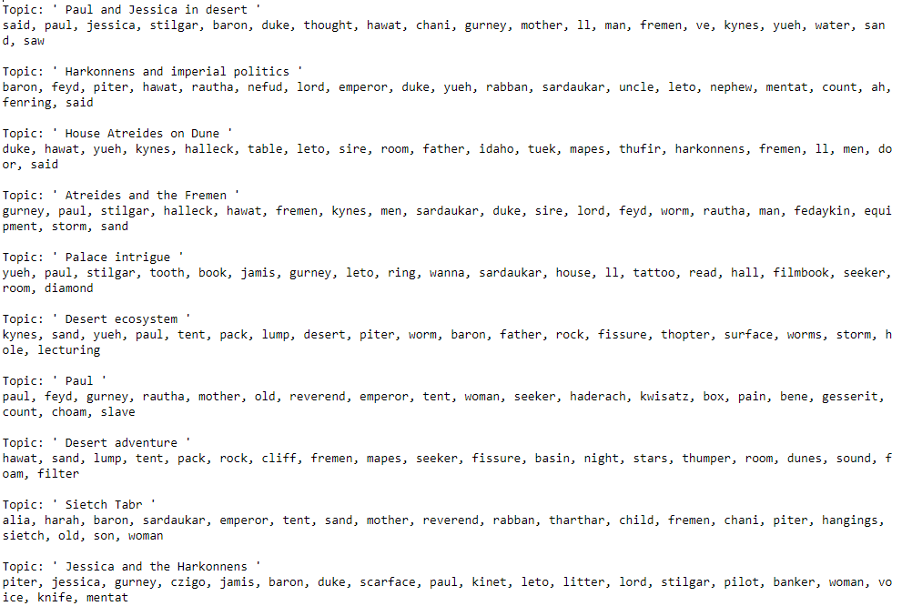
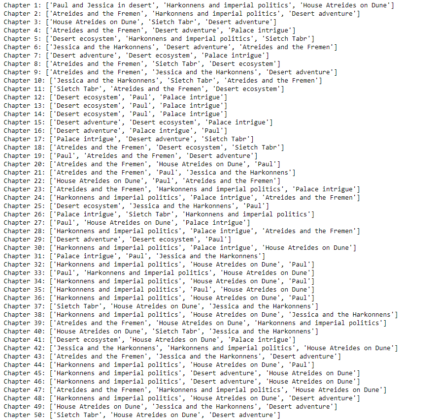

# MVP
Matt Ryan
___

For my MVP, I have done initial topic modeling using LSA on a TF-IDF weighted text vectorizer, with each document being a chapter in the first Dune book. Here, we are using 10 topics modelled from the a total of 50 chapters. These topics are:

and the top 3 topic associations for each chapter are:

Some next steps are to apply topic modeling to all chapters from all books and then assess topic counts/topic strengths for each book